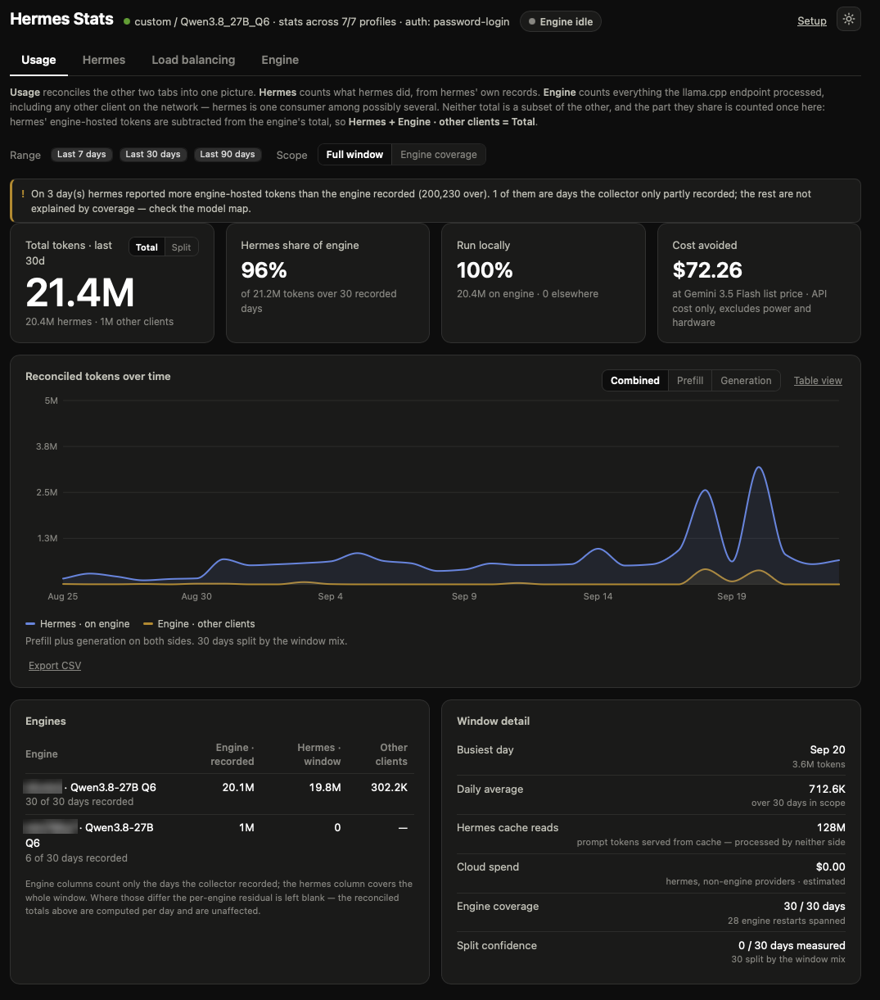
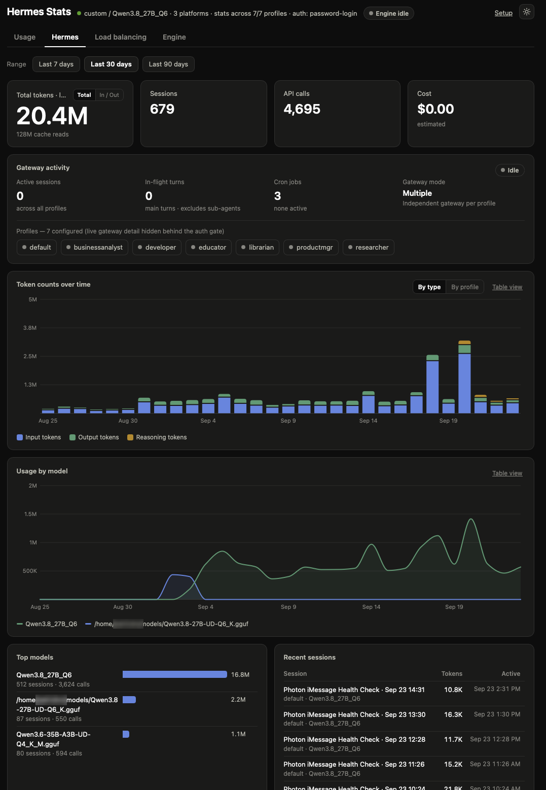
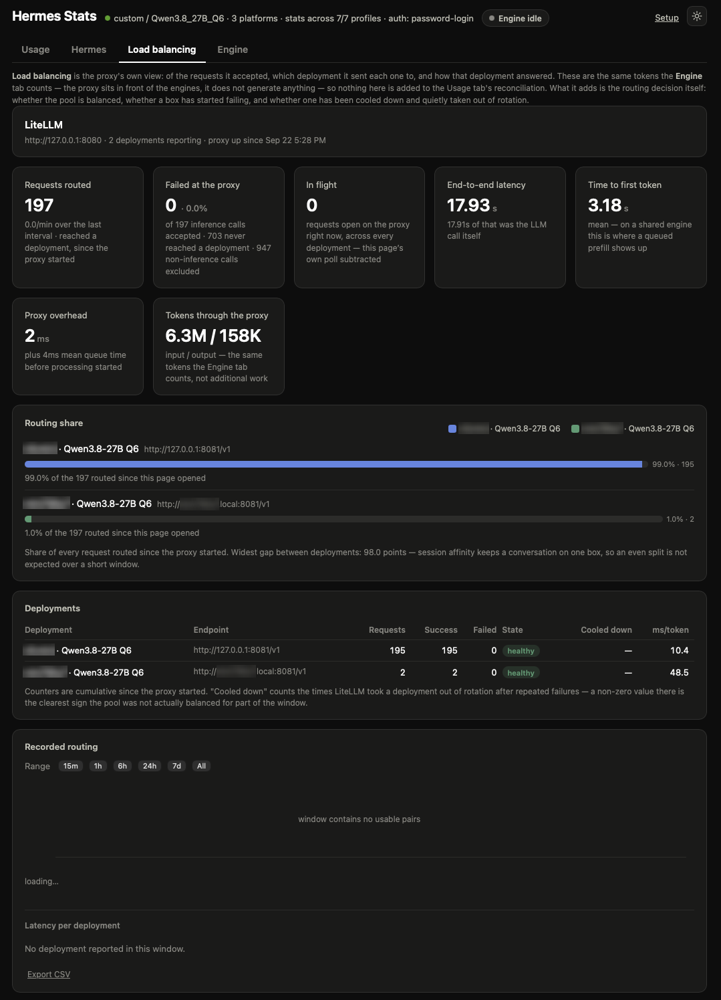
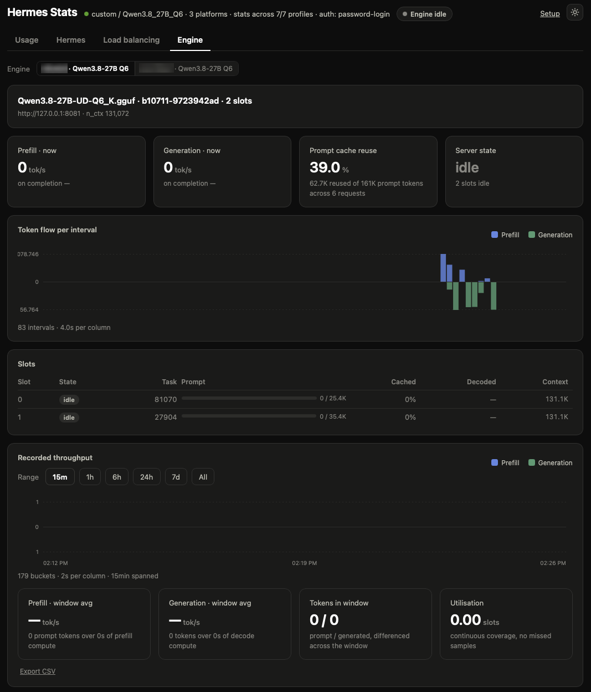

# hermes-stats-dash

[hermes-workspace](https://github.com/outsourc-e/hermes-workspace) was a
browser-based front end for [hermes-agent](https://github.com/NousResearch/hermes-agent) —
chat, dashboard, the works. The launch of the official Hermes desktop client
made most of that HTML-interface work redundant: the desktop app is now the
supported way to chat with and manage a Hermes agent, and it shipped its own
login flow, which is also what pushed hermes-agent's dashboard off the old
simple-key auth and onto the `dashboard_auth` provider framework (OAuth /
OIDC / password) in v0.17.

What the desktop client doesn't cover is a lightweight, always-on view of
**hermes' usage** — token counts over time, sessions, top models — or of
**the llama.cpp engine underneath it** — live throughput, slot occupancy,
whether requests are queueing. That gap is what this project fills: a small,
standalone dashboard of three tabs, plus a fourth when a load-balancing proxy
sits between them.

- **Usage** — the two sides reconciled into one picture: total work done,
  how much of it was hermes', and how much came from other clients on the
  same endpoint.
- **Hermes** — demand-side accounting from hermes' own rollups: what hermes
  sent, extracted from hermes-workspace's dashboard capability and trimmed
  to the stats surface.
- **Load balancing** — *only when a LiteLLM proxy is configured.* Which
  deployment the proxy routed each request to, and whether any of them is
  failing or has been cooled down out of rotation.
- **Engine** — supply-side telemetry read straight from a llama.cpp server's
  `/metrics`, `/slots`, and `/props`, plus recorded history from a small
  companion collector.

**Hermes and Engine are different populations, not two views of the same
number.** llama.cpp sees every client on the endpoint, hermes included;
hermes sees models the engine cannot, including ones not served by this
llama.cpp instance at all. Neither total contains the other — see [§1 of the
engine design doc](docs/engine-telemetry-plan.md#1-project-statement).

The Usage tab is where the overlap between them is computed rather than left
to the reader: hermes' engine-hosted tokens are subtracted from the engine's
total, so **Hermes + Engine · other clients = Total** with nothing
double-counted. How that is derived, and where it is approximate, is in
[docs/unified-usage-plan.md](docs/unified-usage-plan.md).

Zero runtime dependencies. Node ≥ 18.

## What this shows

### Usage tab (reconciled)



- **Reconciled totals** — one total for the window, split into hermes'
  own tokens and the residual from other clients on the endpoint, with a
  `Total / Split` hero toggle
- **Reconciled tokens over time** — three smooth daily series (hermes on
  engine, hermes elsewhere, engine · other clients) with a
  **Combined / Prefill / Generation** lane toggle, a table-view twin and CSV
  export. Days the collector never recorded are shaded, never drawn as zero
- **Scope toggle** — `Full window` or `Engine coverage`. A collector younger
  than the selected range would otherwise produce a total mixing 30 days of
  hermes with 4 days of engine data; clipping to recorded days makes it one
  window again
- **Hermes share of engine** — how much of what the endpoint served was
  hermes', computed over recorded days only
- **Run locally** — the share of hermes' work that ran on an engine rather
  than a hosted provider
- **Cost avoided** — what the engine-hosted tokens would have cost at a
  comparator's list price (default Gemini 3.5 Flash, $1.50/$9.00 per 1M).
  API list price only: it excludes power, hardware and operator time, and
  is not a claim that the two models are equivalent
- **Engines** — per-engine totals, hermes' share of each, and the
  other-client residual where the windows are comparable
- **Window detail** — busiest day, daily average, hermes cache reads, cloud
  spend, collector coverage, and how many days' splits were measured rather
  than estimated
- **Warnings** — a named line for every condition that makes the numbers
  approximate: partial collector coverage, a hermes profile that did not
  answer, a clamped residual (and whether coverage explains it), an engine
  with no models mapped, models that look local but are unmapped

### Hermes tab



- **Token counts over time** — stacked daily token columns, switchable
  between **By type** (input / output / reasoning, cache reads in the tooltip)
  and **By profile** (one segment per profile, tail folded into "Other").
  Both views share the same daily total and a table-view twin
- **Usage by model** — smooth per-model curves of daily token volume
  (top models get fixed colors, the tail folds into "Other"); derived from
  the sessions list since the usage endpoint has no model × day breakdown
- **Gateway activity** — live busy/idle badge, in-flight `active_agents`,
  active sessions, cron jobs, gateway mode (explained below), and the set of
  configured profiles with their live gateways highlighted
- **Totals** — tokens, sessions, API calls, cost for the selected window
- **Top models** — token volume, sessions, and API calls per model
- **Recent sessions** — latest activity with model and token counts

### Load balancing tab (LiteLLM)



Hidden unless a LiteLLM proxy is enabled under Setup → Load balancing. A
proxy is a *router*, not a worker: the tokens it counts are the same tokens
the engines behind it already report, so **nothing on this tab feeds the
Usage tab's reconciliation** — folding it in would double-count every
request. What it adds is the one thing neither other tab can see: the
routing decision.

- **Live panel** — requests *routed* and the live rate, failures at the proxy
  with an error rate, in-flight requests, mean end-to-end latency split into
  the LLM call and LiteLLM's own overhead, time to first token, and tokens
  through the proxy. "Routed" and "accepted" are separate numbers on purpose:
  the first is what reached a deployment, the second also holds requests that
  failed before routing
- **Routing share** — a bar per deployment: its share of everything routed
  since the proxy started, *and* its share of what has been routed since the
  page was opened. The cumulative split is dominated by whatever happened
  hours ago; the second number is the one that answers "is it balancing
  right now"
- **Deployments** — one row per deployment: requests, successes, failures
  (broken out by HTTP status), health state (healthy / partial outage /
  outage), **cooldowns**, and latency per output token. A non-zero cooldown
  is the clearest evidence the pool was *not* actually balanced for part of
  the window — LiteLLM took a box out of rotation after repeated failures
- **Recorded routing** — the same 15m/1h/6h/24h/7d/all range picker as the
  Engine tab, over a per-deployment request-rate chart with a window summary
  and CSV export. A proxy restart breaks the line rather than spiking it, and
  a collector outage is shaded rather than drawn as zero
- **Named to match** — LiteLLM identifies a deployment by the `model_info.id`
  in its config. Where that id equals a configured engine's id, the rows are
  labelled with the engine's label, so the tab names the same hosts the
  Engine tab does. Where it doesn't, the raw id is shown and the tab says so

**Requirements on the proxy side**, both of which this tab reports by name
when they're missing:

- `litellm_settings.callbacks: ["prometheus"]` in the LiteLLM config, **and
  `prometheus_client` installed in the proxy's environment**. The callback
  mounts `/metrics` at startup; if the import fails the proxy exits, and if
  it is installed after the proxy started, `/metrics` stays unmounted (404)
  until a restart
- A key. LiteLLM serves `/metrics` behind the same auth as its API, so this
  needs the proxy's `master_key` or a virtual key with permission — the only
  credential this app holds besides the hermes one

### Engine tab



- **Live panel** — prefill and generation throughput (both a short live
  reading off `/slots` progress and a settled on-completion figure from
  `/metrics` counters), prompt-cache reuse, server state (idle / prefilling
  / generating / queued), a per-slot table, and an endpoint + model identity
  line (URL, model file, build, `n_ctx`)
- **History panel** — a range picker (15m/1h/6h/24h/7d/all) over data the
  collector has recorded, a canvas strip chart, a window summary (average
  throughput, token volumes, mean busy slots, sample coverage), and a CSV
  export. A server restart mid-window renders as a break, not a false spike;
  a collector outage renders as a visible gap, not a silent zero
- **Multi-engine** — an engine picker when more than one is configured;
  switching discards in-memory state, since neither counters nor epochs are
  comparable across endpoints
- **Honest degradation** — llama.cpp builds vary: some `/slots` responses
  omit prompt-token fields entirely, some report `next_token` as a
  one-element array instead of an object. The server feature-detects both
  per poll and the UI says so (e.g. "Unavailable: this build's `/slots` does
  not report `n_prompt_tokens_cache`") rather than silently showing a zero

### Engine health badge

A small badge in the shared header, visible from every tab, answering
one question: *is the engine underneath currently a bottleneck?* It's keyed
on `requests_deferred`, not slot occupancy — a fully-busy engine is normal
(**Full**, amber); a *queueing* engine (**Queued**, red, shows the count) is
the one state that actually explains a slow session. Other states: **Idle**,
**Active**, **Not responding** (a `/metrics` timeout — itself weak evidence
of load, reported as its own state), **Unreachable**, and **Stale** (no
successful poll in 90s — shown rather than a confidently wrong old state).
Hidden entirely with no engine configured. Wording never says "your
requests" — it names the endpoint and notes load may include other clients.
Clicking it opens the Engine tab.

Zero collector dependency: the badge's route (`GET /api/engine/health`)
reads only `llamaUrl`, so it works even with the collector not installed —
only the History panel needs the collector.

Both light and dark themes; the light/dark toggle is shared across both
pages and both tabs.

## How it works

`server.mjs` is a single-file server: static file serving plus a handful of
JSON API routes, all fanning out in parallel to upstreams and nulling a
section on failure rather than failing the whole request.

### Usage and Hermes routes

| Route | Fans out to |
|---|---|
| `GET /api/usage/unified?days=N` | The Usage tab's single source. Splits hermes' usage by the engine model map, folds each collector's history into UTC days, reconciles the two, and returns the daily series, totals per lane, per-engine breakdown and warnings |
| `GET /api/overview?days=N` | `/api/analytics/usage` (once per profile, merged), `/api/profiles/sessions`, `/api/status`, `/api/cron/jobs`, `/api/model/info` — see [Cross-profile aggregation](#cross-profile-aggregation) below |
| `GET /api/settings` / `POST /api/settings` | reads/writes `~/.hermes-stats-dash/config.json` |
| `POST /api/test` | probes a hermes dashboard URL + credentials, used by the Setup page |

### Engine routes

| Route | Behaviour |
|---|---|
| `GET /api/engine/live?engine=<id>` | Fans out to the engine's `/metrics`, `/slots`, `/props` in parallel. Parses the Prometheus text server-side (so the frontend never touches raw upstream shapes) and returns feature-detection flags (`hasPromptFields`, `nextTokenShape`) alongside the parsed data. Each of the three sections nulls independently on failure |
| `GET /api/engine/history?engine=<id>&from=&to=&points=` | Validated, clamped proxy to the collector's `/history` |
| `GET /api/engine/range?engine=<id>` | Proxy to the collector's `/range`, for the "all" range button |
| `GET /api/engine/health?engine=<id>` | The badge's data source. `/metrics` only, 3s timeout, `total_slots` cached from `/props` for 5 minutes |
| `GET /api/engines` | `[{id, label}, ...]` for the tab's engine picker |
| `POST /api/engine/model-suggest` | Ranks the hermes models actually in use against the file the engine reports at `/props`, for the Setup page's model map. Suggests only — nothing is attributed without a saved mapping |
| `POST /api/engine/test` | Ad-hoc reachability probe for the Setup page's per-engine row (llama-server + collector, independent of saved config) |

### LiteLLM routes

| Route | Behaviour |
|---|---|
| `GET /api/litellm/live` | The Load balancing tab's live source. Fetches the proxy's `/metrics/` with the configured key, parses the Prometheus text **with labels** (unlike the engine routes — for LiteLLM the label set *is* the data), folds the label explosion down to one row per `model_id`, and joins each to a configured engine where the ids match. `{enabled: false}` when no proxy is configured, which is what hides the tab |
| `GET /api/litellm/history?from=&to=&points=` | Validated, clamped proxy to the collector's `/litellm/history` |
| `GET /api/litellm/range` | Proxy to the collector's `/litellm/range`, for the "all" range button |
| `POST /api/litellm/test` | Ad-hoc probe for the Setup page — metrics endpoint and collector reported separately, since either can be the broken one |

LiteLLM emits every counter once per *(api key × team × user agent × client
IP × …)* combination. Summing over everything but `model_id` is the whole
reduction both here and in the collector: the load-balancing question is only
ever "which box". Failures are the exception — they keep their
`exception_status`, because "which box is failing" is half the answer and
"with what" is the other half.

Three things about that label set are load-bearing, and all three were found
by reading a real scrape rather than the docs:

- **Absent labels are written, not omitted.** LiteLLM emits the literal
  string `"None"` (Python's `str(None)`) on some metric families and `""` on
  others. Taken at face value they produce a deployment called *None* sitting
  in the routing table with zero requests, and an exception status reading
  *None×1*. Both spellings are treated as absent.
- **The proxy's own housekeeping is recorded as failed requests.** A
  `/v1/models` call from hermes, and this dashboard's own `/metrics/` scrape,
  each land in `litellm_proxy_failed_requests_metric_total`. Counted naively
  an idle proxy reads as a 100% error rate. A request counts as inference
  when `requested_model` or `model_id` is populated — a semantic test rather
  than a route denylist that would need an entry every time LiteLLM adds an
  endpoint. The excluded count is shown on the tile, so the exclusion is
  visible rather than silent.
- **The scrape counts itself in `litellm_in_flight_requests`.** Two
  concurrent scrapes read `2`, so the observer subtracts itself — otherwise
  an idle proxy never reads zero.

A routing attempt that failed *before* a deployment was chosen names no box.
It is kept out of the deployment table and the routing share, where it would
be meaningless, and reported separately as "never reached a deployment"
rather than dropped.

Every upstream call uses a short timeout (`UPSTREAM_TIMEOUT_MS`, 10s for
most routes; 3s for the health badge) so a stalled upstream degrades a
section to null rather than hanging the request — `/metrics` and `/slots`
are answered off llama-server's own task queue and can block for seconds
under heavy decode. `/api/analytics/usage` is the exception, at 45s
(`ANALYTICS_TIMEOUT_MS`): it is a SQL aggregation over a whole profile's
session DB and a 90-day call on a large profile routinely passes 10s. A
dropped profile there is not cosmetic — it understates hermes and inflates
the reconciled other-clients residual — so it gets a real budget, and any
profile that still fails is reported rather than merged around.

`public/index.html` is the whole frontend for every tab (vanilla JS + SVG
for the Usage charts, canvas for the Engine strip charts and the Load
balancing routing chart — 400+ columns is more than SVG wants to redraw
every poll). No build step.

### Cross-profile aggregation

Every hermes profile has its own session DB, and `/api/analytics/usage` is
single-profile — so on a multi-profile install the default-scoped numbers
undercount the whole workspace. `buildOverview` reads the profile list from
`/api/status`, fans out one `usage` call **per profile**, and sums hermes'
authoritative rollups (daily token rows, per-model breakdown, and totals).
Summing the server-side SQL rollups is more accurate than re-deriving from a
capped session list, and a profile that errors or has no DB yet is simply
skipped, so a partial fan-out still aggregates. The status line shows
`stats across N/M profiles`, and the recent-sessions + per-model views draw
from the cross-profile `/api/profiles/sessions` list (each row tagged with
its owning profile). The one dimension hermes has no endpoint for —
per-day-**per-model** volume — is still derived from that session list, so it
is an approximation over the sampled window while the token totals and
per-model totals come from the authoritative rollups.

### Reconciling hermes against the engine

The Usage tab's arithmetic, per UTC day and per lane:

```
Engine · other clients = max(0, engine_tokens − hermes_engine_tokens)
Total = hermes_other + hermes_engine + Engine · other clients
```

hermes reporting 1M tokens against an engine-hosted model while the engine
reports 2M is shown as **Hermes 1M · Engine 1M · Total 2M**. The engine's 2M
appears nowhere, because half of it *is* the hermes 1M. The residual is real
traffic from other clients — `llama-server` binds without auth, so anything
on the LAN or tailnet can use it — and is labelled as such, never as
"unaccounted".

Producing that takes three joins, each with a limit worth knowing:

- **Which hermes models are engine-hosted** comes from the model map above.
  Nothing is inferred at request time.
- **hermes' daily split** has no direct source: hermes' `daily` rollup has no
  model dimension and its `by_model` rollup has no day dimension. So
  `by_model` fixes the ratio between the two sides, the daily rollup is
  apportioned by the per-day model mix derived from the session list, and the
  result is scaled to the window total — the chart and the tiles cannot
  disagree. Days with no session rows fall back to the window ratio and are
  reported as estimated. Magnitudes are anchored to hermes' `totals` block,
  which is what the Hermes tab shows, so the two tabs agree.
- **The engine's daily totals** are differenced out of the collector's
  monotonic counters at hourly buckets folded into UTC days. A restart is
  counted (the pre-restart tail is recovered from the bucket and the counter
  re-anchored at zero) and flagged, unlike the Engine tab's history panel,
  which drops restart pairs because it renders rates rather than volumes.
  Closed days are immutable and cached per engine; only today refetches.

**Both lanes are exact, which the plan did not expect.** hermes'
`input_tokens` is already net of cache reads (`cache_read_tokens` is a
separate and much larger field — 1.1B against 95M here), and llama.cpp's
`prompt_tokens_total` is already net of KV prefix reuse, so the two are on
the same denominator with no correction. On a fully-covered day with little
other traffic they track to within a few percent. Generation matches
outright. See [§3 of the plan](docs/unified-usage-plan.md) for the
measurement.

**Where it is approximate**, and always said out loud on the tab: a
collector younger than the window (use the Scope toggle), a hermes profile
that failed to answer, days split by the window mix rather than their own
sessions, and any day where hermes exceeds the engine — flagged with whether
coverage explains it or the model map is suspect.

### Gateway activity & profiles

The activity card combines hermes' `/api/status` topology with a
cross-profile session scan:

- **Active sessions** — the reliable "what's running now" signal, from
  `/api/profiles/sessions` filtered by each row's `is_active` flag. This
  scans **every** profile, which matters under `gateway_mode: multiple`:
  a live session on a non-default profile is invisible to the default
  gateway's own `active_sessions` count, so relying on `/api/status` alone
  (as the first cut did) shows nothing. Each active session is listed with
  its profile, model, message count, and age; the badge reads **Active** when
  any session is live.
- **In-flight turns** (`active_agents`) — running main gateway turns + cron
  jobs + API runs; drives the **Busy** badge. **Sub-agents are not counted
  here.** hermes runs `delegate_task` sub-agents in-process under the parent
  session — they create no child session rows (`parent_session_id` is never
  set on the wire) and no endpoint exposes them, so a session busy with
  sub-agents shows `0` in-flight turns while still appearing as an active
  session. The card says so explicitly rather than implying the gateway is
  idle.
- **`gateway_mode`** — how profiles map to gateway processes:
  | Mode | Meaning |
  |---|---|
  | `single` | One gateway serving one profile |
  | `multiplex` | One gateway serving several profiles |
  | `multiple` | An independent gateway per profile |
  | `none` | No gateway process running |
- **Profiles** — every configured profile. Those with a live gateway are
  tagged **live** (from `gateways[]`, only returned on a **loopback /
  `--insecure`** bind); behind the v0.17+ auth gate that detail is withheld,
  so the card instead tags profiles that have an **active session** from the
  cross-profile scan.

## Run

```sh
npm start          # serves http://127.0.0.1:8788
```

With a hermes-agent dashboard running locally on the default port, that's
it for the Hermes tab. For a remote or auth-gated hermes, or to configure an
Engine tab, open `/setup.html`.

No hermes handy? `node scripts/mock-hermes.mjs` fakes one on :9119
(`node scripts/mock-hermes.mjs password` simulates a v0.17+ auth-gated
dashboard — credentials `admin` / `hermes`).

## Configuration

Everything is configurable from the **Setup page** (`/setup.html`), saved to
`~/.hermes-stats-dash/config.json` (owner-only `0600` — it can hold hermes
credentials; engine entries hold none).

### Hermes connection

Remote URL, credentials, a **Test connection** button that reports
reachability / auth mode / whether a credential was cached, and a way to
forget cached tokens. Saved settings take precedence over the environment:

| Env var | Default | Purpose |
|---|---|---|
| `PORT` | `8788` | Port for this app |
| `HOST` | `127.0.0.1` | Bind address (see below) |
| `HERMES_DASHBOARD_URL` | `http://127.0.0.1:9119` | hermes-agent dashboard service |
| `HERMES_DASHBOARD_TOKEN` | – | Bearer token (v0.17+ token-auth seam) |
| `HERMES_DASHBOARD_COOKIE` | – | Session cookie (v0.17+ interactive auth) |
| `HERMES_DASHBOARD_USERNAME` / `_PASSWORD` | – | Password-provider login (v0.17+) |

### Engines (Engine and Usage tabs)

A **list** — the real deployment this was built for has two llama.cpp
servers with different models, builds, and context sizes. Each entry:

```json
{
  "engines": [
    { "id": "nfcmini",   "label": "nfcmini · Qwen3.8-27B Q6",
      "llamaUrl": "http://127.0.0.1:8081",
      "collectorUrl": "http://127.0.0.1:8082",
      "models": ["/home/patrickm/models/Qwen3.8-27B-UD-Q6_K.gguf",
                 "Qwen3.8_27B_Q6"] },
    { "id": "mini795s7", "label": "mini795s7 · Qwen3.8-27B Q6",
      "llamaUrl": "http://10.0.0.66:8081",
      "collectorUrl": "http://10.0.0.66:8082",
      "models": ["Qwen3.8_27B_Q6"] }
  ]
}
```

`llamaUrl` is required; `collectorUrl` is optional — without it the Engine
tab's live panel and health badge still work, but the History panel shows an
install prompt instead of a chart. The Setup page's **Engines** card lets
you add/remove/edit rows and **Test connection** each one (reachability,
whether `/metrics` is enabled, whether the collector answers) before saving.

`models` is the **model map**: the hermes model names this engine serves. It
is what the Usage tab subtracts, so hermes' own traffic is not counted twice
against the engine's total. hermes names a model whatever its provider
config says and llama-server reports a filesystem path, so the join cannot
be inferred safely — **Suggest models** ranks the models hermes has actually
used against the engine's `/props` file and you click the ones that are
right. An engine with no models mapped has *all* of its traffic attributed
to other clients, and the Usage tab warns about it. A model name mapped to more than one
engine is attributed to the first in config order, so it is never subtracted
twice — but the Usage tab can then no longer split that model's hermes traffic
between those engines. Give each host a distinct `--alias` if the split matters.

For a single-engine deployment with no saved config, these two env vars are
an equivalent fallback:

| Env var | Purpose |
|---|---|
| `LLAMA_SERVER_URL` | e.g. `http://127.0.0.1:8080` |
| `LLAMA_COLLECTOR_URL` | e.g. `http://127.0.0.1:8081` (optional) |

### LiteLLM (Load balancing tab)

One optional entry, off unless enabled on the Setup page. Unlike an engine,
this one *does* hold a credential:

```json
{
  "litellm": {
    "enabled": true,
    "label": "nfcmini · LiteLLM",
    "url": "http://127.0.0.1:8080",
    "apiKey": "sk-…",
    "collectorUrl": "http://127.0.0.1:8082"
  }
}
```

| Field | Purpose |
|---|---|
| `enabled` | `false` hides the tab entirely without discarding the rest of the entry. A `#lb` deep link falls back to Usage rather than landing on a hidden tab |
| `url` | The proxy's base URL. The metrics endpoint is fetched at `/metrics/` — LiteLLM mounts it as a sub-app, so the bare `/metrics` answers a 307 redirect, and asking for the slash saves a round trip on every poll |
| `apiKey` | The proxy's `master_key` or a virtual key. Never leaves the server: the Setup page reports only whether one is held and from where, exactly as it does for the hermes password. Omit it and set `LITELLM_MASTER_KEY` in the environment instead to keep the key out of this file |
| `collectorUrl` | A collector running with `--litellm` against this proxy — usually the *same* collector as that host's engine. Without it the tab shows live counters only |

Equivalent env vars for a deployment that would rather not persist the key:
`LITELLM_URL`, `LITELLM_COLLECTOR_URL`, and either `LITELLM_API_KEY` or
`LITELLM_MASTER_KEY` — the second is the name LiteLLM's own config reads, so
`EnvironmentFile=` pointed at the proxy's env file supplies it directly. A
key saved from the Setup page takes precedence over both.

**Why this is not in the Usage tab.** With hermes pointed at the proxy the
path is hermes → LiteLLM → the engines. LiteLLM's token counters count the
same tokens the engines' counters already do; it routes work, it does not do
any. Adding it to the reconciliation would double-count every request that
went through it. The Load balancing tab therefore stands alone, and says so
at the top.

### Cost-avoidance comparator (Usage tab)

The Usage tab prices hermes' engine-hosted tokens against a hosted model to
answer "what did running this locally save in API fees". The default is
Gemini 3.5 Flash at its published list price ($1.50 in / $9.00 out per 1M
tokens, verified August 2026); override it in the config file:

```json
{
  "comparator": {
    "model": "Gemini 3.5 Flash",
    "input_per_m": 1.5,
    "output_per_m": 9.0,
    "cached_input_per_m": 0.15
  }
}
```

It is a list-price comparison and the tile says so: it excludes electricity,
hardware and operator time, and asserts no quality equivalence between the
local model and the comparator.

**Address choice for a remote engine:** prefer a LAN IP over mDNS
(`*.local`) — mDNS resolution costs ~100ms per call, negligible for a human
clicking a page but wasteful for something polled every few seconds.
Tailscale would be preferable (authenticated, encrypted) if it works between
the two hosts; if not, a plaintext LAN hop is what this dashboard assumes.

## Engine and Load balancing prerequisite: the telemetry collector

The Engine tab's **live** panel and the **health badge** need only
`llamaUrl` — a llama.cpp server started with `--metrics` is enough. The
**History** panel additionally needs a collector: a small, dependency-free
Python process that polls `/metrics` and `/slots` on an interval, writes one
row per poll to SQLite, and serves a read-only JSON API (`/range`,
`/history`) that this dashboard proxies.

A reference copy of the collector lives at [`docs/collect.py`](docs/collect.py)
(see [`docs/engine-telemetry-plan.md`](docs/engine-telemetry-plan.md) for
the full design rationale). It is **not** run by `server.mjs` — deploy it
separately, once per llama.cpp host:

```sh
mkdir -p ~/llamacpp-telemetry
cp docs/collect.py ~/llamacpp-telemetry/collect.py
python3 ~/llamacpp-telemetry/collect.py \
  --db ~/llamacpp-telemetry/telemetry.db \
  --server http://127.0.0.1:8080 \
  --interval 5 \
  --port 8081
```

`--server` and `--port` assume llama-server on `:8080` and the collector on
`:8081`, which are only defaults — **both hosts in the example config above
have moved off them**: mini795s7 runs open-webui on `:8080`, so llama-server
took `:8081` and the collector `:8082`, and nfcmini was later shifted the same
way. Read a host's actual ports out of its unit
(`systemctl --user cat llamacpp-telemetry.service`, `ss -ltnp`) rather than
assuming. When llama-server moves, `--server` has to follow: a collector left
pointing at the old port records failed samples (`down:` in its journal) and
its `/range` keeps serving stale metadata, which looks like an idle engine
rather than a broken collector.

Stdlib only, no dependencies, works on any Python 3. In production, run it
as a **systemd user unit** so it survives logout and restarts on crash:

```ini
# ~/.config/systemd/user/llamacpp-telemetry.service
[Unit]
Description=llama-server telemetry collector
After=network-online.target

[Service]
Type=simple
ExecStart=/usr/bin/python3 %h/llamacpp-telemetry/collect.py \
  --db %h/llamacpp-telemetry/telemetry.db \
  --server http://127.0.0.1:8080 \
  --interval 5 \
  --port 8081
Restart=always
RestartSec=10
StandardOutput=journal
StandardError=journal

[Install]
WantedBy=default.target
```

### Collecting LiteLLM alongside it (`--litellm`)

The Load balancing tab's **History** panel needs a collector too, and it is
the *same* collector: `--litellm <url>` makes `collect.py` poll a LiteLLM
proxy's `/metrics/` on the same interval, into its own tables
(`litellm_samples`, `litellm_deployments`) and its own read-only routes
(`/litellm/range`, `/litellm/history`). Only the host that runs the proxy
needs the flag; other hosts run the identical file without it.

The key comes from the environment in preference to `--litellm-key`, because
an argument is visible in `ps(1)` to every user on the box. Both
`LITELLM_API_KEY` and `LITELLM_MASTER_KEY` are read — the latter is the name
LiteLLM's own config uses, so the unit can point straight at the proxy's
existing env file and the key is never copied into a second place:

```ini
# ~/.config/systemd/user/llamacpp-telemetry.service — the proxy's host
[Service]
Type=simple
EnvironmentFile=%h/litellm/litellm.env      # already holds LITELLM_MASTER_KEY
ExecStart=/usr/bin/python3 %h/llamacpp-telemetry/collect.py \
  --db %h/llamacpp-telemetry/telemetry.db \
  --server http://127.0.0.1:8081 \
  --litellm http://127.0.0.1:8080 \
  --interval 5 \
  --port 8082
```

The collector prints `no key — /metrics is likely to answer 401` at startup
when it has none. The dashboard reads the same two variable names, so giving
`hermes-stats-dash.service` the same `EnvironmentFile=` configures the tab
without writing the key into `config.json` at all.

The two populations never mix: a LiteLLM outage records a failed LiteLLM
sample and leaves llama-server sampling untouched, and vice versa. Verify
with `curl http://<host>:<collector-port>/litellm/range` — it should return
a `deployments` array naming each `model_info.id` the proxy has routed to.
An empty array means the proxy answered but has served nothing yet: LiteLLM
creates a deployment's series only on its first request.

```sh
systemctl --user daemon-reload
systemctl --user enable --now llamacpp-telemetry.service
loginctl enable-linger "$USER"   # keeps user units running after logout
```

### Collector bind address (`--bind`)

This is a **per-collector deployment choice**, independent of anything this
dashboard does. This dashboard reaches a collector through its own proxy
regardless of the collector's bind address — a collector open to the LAN is
still reachable through the proxy, it's just *also* directly reachable,
which matters if anything besides this dashboard needs it:

- **`--bind 0.0.0.0`** (default) — reachable from any host on the LAN.
  Needed if a standalone telemetry page, another dashboard instance, or any
  other direct client should be able to reach it.
- **`--bind 127.0.0.1`** — reachable only from the same host. Appropriate
  once this dashboard is the collector's only caller and it runs on the same
  machine as the collector (the common case for the "local" engine in a
  multi-engine setup — see the example config above, where the co-located
  engine dials `127.0.0.1` and the remote one dials a LAN IP).

The collector has **no authentication of its own**. `--bind 0.0.0.0` means
anything on the LAN can read the recorded history; `127.0.0.1` avoids that
at the cost of the flexibility above. Neither this dashboard nor
`docs/collect.py` enforces one choice — pick per deployment.

Verify a collector is up: `curl http://<collector-host>:<collector-port>/range`
should return `{"from":..., "to":..., "rows":N, ...}`. Check it is *recording*,
not merely answering, by calling it twice: `rows` **and** `ok_rows` should both
climb by about `interval⁻¹` per second. `rows` climbing alone means it is
polling an address llama-server no longer holds.

## Running this dashboard as a service

`npm start` is fine for trying it out, but it dies with the terminal
session it started in. To keep it running:

```ini
# ~/.config/systemd/user/hermes-stats-dash.service
[Unit]
Description=hermes-stats-dash
After=network-online.target

[Service]
Type=simple
WorkingDirectory=%h/hermes-stats-dash
ExecStart=/usr/bin/node %h/hermes-stats-dash/server.mjs --remote
Restart=always
RestartSec=10
StandardOutput=journal
StandardError=journal

[Install]
WantedBy=default.target
```

```sh
systemctl --user daemon-reload
systemctl --user enable --now hermes-stats-dash.service
```

Drop `--remote` from `ExecStart` (or change it to `--host <addr>`) to bind
somewhere other than every interface — see [Local vs. remote
access](#local-vs-remote-access) below.

## Updating a deployment

**The dashboard** runs from a git checkout (`~/hermes-stats-dash`, as in the
unit above), so an update is a pull and a restart. Saved settings live in
`~/.hermes-stats-dash/config.json`, outside the checkout, and survive it:

```sh
cd ~/hermes-stats-dash
git pull --ff-only origin main
node --check server.mjs                        # refuse to restart onto a syntax error
systemctl --user restart hermes-stats-dash.service
journalctl --user -u hermes-stats-dash.service -n 5 --no-pager
```

The log should show the listening address, the upstream dashboard URL and
the auth mode. `curl -s http://127.0.0.1:8788/api/usage/unified?days=7`
confirms hermes and the engines both answer; its `warnings` array is the
same list the Usage tab shows.

**A collector** is a single copied file, not a checkout. Push the reference
copy from this repo to each engine host and restart its unit:

```sh
scp docs/collect.py <engine-host>:llamacpp-telemetry/collect.py
ssh <engine-host> 'systemctl --user restart llamacpp-telemetry.service'
curl http://<engine-host>:<collector-port>/range
```

The database (`telemetry.db`) sits beside the script and is kept across a
restart, so history continues — the LiteLLM tables are created on first
start, so an existing database picks them up without migration. The
collector's arguments are per-host (see above); check them with
`systemctl --user cat llamacpp-telemetry.service` rather than assuming the
defaults. If the host was rebuilt and the unit is gone, it's a fresh install:
follow the collector steps above, including `loginctl enable-linger`.

A collector still running an older copy of `collect.py` answers 404 on the
`/litellm/*` routes; the Load balancing tab and the Setup page's test both
say so by name rather than showing it as "no data recorded yet".

**After an engine host changes** — a new model, port, or LAN address — update
its entry under Setup → Engines (or `POST /api/settings`), run **Test
connection**, and re-check the model map with **Suggest models**. Keep names
hermes used under the old model in the map: the Usage tab's 30- and 90-day
windows still contain that traffic.

## Local vs. remote access

By default the server binds **`127.0.0.1`** — reachable only from the same
machine. To let other devices reach it, open the bind address:

```sh
npm start -- --remote            # bind 0.0.0.0 (all interfaces)
npm start -- --host 100.x.y.z    # bind a specific address, e.g. a Tailscale IP
HOST=0.0.0.0 npm start           # same via env var
```

Precedence: `--host` › `--remote`/`-r` › `HOST` › loopback default.

> ⚠ This server has **no authentication of its own** and can hold the
> upstream dashboard credentials you configure. When bound to a non-loopback
> address it prints a warning — only expose it on a trusted network (a
> Tailscale/VPN address, not `0.0.0.0` on a public interface).

## Authentication — the hermes v0.17 change

hermes-agent **v0.17** replaced the dashboard's simple-key login with the
`dashboard_auth` provider framework. This app supports both worlds, resolved
in this order:

1. **Bearer token** — sent as `Authorization: Bearer …`. This is the v0.17+
   non-interactive seam (`dashboard_auth/token_auth.py`) intended for
   service-to-service callers like this one. Note it only authorizes routes
   hermes has registered as token-authable; if your build hasn't registered
   the analytics routes, use one of the modes below.
2. **Session cookie** — a cookie copied from a browser after logging in
   through a v0.17+ provider (Nous OAuth, self-hosted OIDC, or basic
   password), for dashboards bound to a non-loopback host.
3. **Username / password** — for gateways whose dashboard sits behind a
   password provider. The server discovers the provider via
   `GET /api/auth/providers`, logs in with `POST /auth/password-login`,
   caches the minted `hermes_session_*` cookies, and re-logs-in
   automatically when a request comes back 401 (session expiry or restart).
4. **Loopback token scrape (default)** — when the dashboard binds to
   `127.0.0.1` (no auth gate), hermes still injects an ephemeral
   `window.__HERMES_SESSION_TOKEN__` into its root HTML — the pre-v0.17
   "simple key". The server scrapes it on demand, caches it, and re-scrapes
   once on a 401 (the token rotates every dashboard restart). No
   configuration needed.

This auth model applies to the Usage tab's hermes connection only. The
Engine tab's llama.cpp and collector connections have no auth of their own
(see [Collector bind address](#collector-bind-address---bind) above) —
that is a property of the upstream, not something this app adds.

LiteLLM is the one other upstream that *does* authenticate: it serves
`/metrics` behind the same gate as its API, so the Load balancing tab needs a
key. It is a single static key sent as `Authorization: Bearer …`, with none
of the discovery, caching or re-login the hermes path needs, and it is stored
in the same owner-only `config.json`.

## Provenance

- Aggregation pattern, endpoint list, and loopback token scrape:
  `hermes-workspace/src/server/dashboard-aggregator.ts`,
  `src/server/gateway-capabilities.ts`,
  `src/routes/api/dashboard/overview.ts`
- Upstream API shapes and auth model: `hermes-agent/hermes_cli/web_server.py`
  (`/api/analytics/usage`, `/api/sessions`) and
  `hermes-agent/hermes_cli/dashboard_auth/`
- Engine tab: direct successor to a standalone `llamacpp-telemetry.html`
  page (kept in service, unmodified, alongside this tab — see
  [`docs/engine-telemetry-plan.md`](docs/engine-telemetry-plan.md) §1).
  Live-rate math (slot-progress differencing, prompt-cache reuse tracking,
  decode-counter fallback) and the collector (`docs/collect.py`) are ported
  from that page and its companion service.
