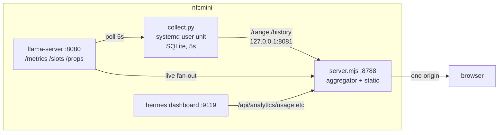

# Engine telemetry tab — project statement and plan

**Status:** proposed
**Date:** 2026-07-31
**Repo:** `pclarytx10/hermes-stats-dash`
**Scope:** add a second tab to hermes-stats-dash showing live and historical
llama.cpp server telemetry, fed through the existing Node aggregator.

---

## 1. Project statement

### The problem

hermes-stats-dash answers *who consumed what*: daily token counts, sessions,
top models, cost — demand-side accounting, aggregated per day, read from
hermes-agent's own rollups.

It cannot answer *how the engine underneath is performing*. When a session feels
slow there is no way to tell from this dashboard whether the model is
prefill-bound, whether the slots are saturated, whether prompt cache is being
hit, or whether another client is competing for the same server. Those are
supply-side questions, they live on a seconds-to-minutes timescale, and today
they require a separate ad-hoc page pointed straight at `llama-server`.

The two are the same pipeline measured at opposite ends. On this deployment
hermes' active model is `Qwen3.6-35B-A3B-UD-Q4_K_M.gguf` via provider
`custom:nfcmini`, which is the same model file `llama-server` reports at
`/props` — 22,250 API calls and ~80.7M input tokens attributed to it. Demand and
supply, one machine, two dashboards.

### The attribution boundary — why this is the interesting part

**Neither traffic set contains the other**, and this is the analytical reason the
two views belong side by side rather than merged into one number:

- **llama.cpp sees traffic hermes cannot.** `llama-server` binds `0.0.0.0:8080`
  with no authentication, so any process on the LAN or tailnet can use it.
  hermes is one client among however many. Its `/metrics` counters are the
  ground truth for *everything the engine did*.
- **hermes sees traffic llama.cpp cannot.** hermes' `by_model` breakdown also
  lists `google/gemini-3-flash-preview` and a second local `gemma-4-E4B-it`
  gguf. Not all hermes work goes through this endpoint.

So the engine tab is explicitly **not** "hermes' engine stats". It is *this
llama.cpp endpoint's stats*, of which hermes is one consumer. Presenting it any
other way would invite false inferences — for example, reading a throughput dip
as a hermes problem when a different client is saturating the slots.

Making that boundary legible is a first-class requirement, not a footnote. The
tab must always show which endpoint and which model it is describing, because
the model `llama-server` is currently serving may not be the model the stats tab
is currently summarising.

### What this project delivers

1. A second tab in the existing dashboard, built as the direct successor to
   the standalone `llamacpp-telemetry.html`: live engine telemetry (prefill and
   generation throughput, slot state, prompt cache reuse) plus recorded history
   over minutes to days, **switchable across multiple collectors** — local or
   remote — the same way the standalone page already switches between
   `nfcmini` and `mini795s7`.
2. Fed through `server.mjs`, so the dashboard's own traffic to each engine goes
   through one origin. This does **not** require narrowing what a collector
   accepts — see the deployment topology note below — bind mode (loopback vs.
   network) stays a per-collector choice made at deploy time, independent of
   whether the dashboard also talks to it.
3. An engine-health badge in the shared header, so a degraded endpoint is
   visible from the Usage tab without having to go look for it.
4. An explicit, visible statement of what each half of the dashboard can and
   cannot see.

### Non-goals

- **Not** attributing engine load to individual hermes sessions. llama.cpp's
  `/slots` exposes `id_task`, an internal counter with no path back to a hermes
  session id. Correlating them would need changes on both sides and is out of
  scope.
- **Not** unifying the two into a single set of numbers. They have different
  denominators; a combined "tokens" figure would be wrong.
- **Not** forcing a collector bind-mode change as part of this project.
  Loopback and network binding are both legitimate, chosen per collector
  depending on whether anything besides the dashboard needs to reach it — see
  the deployment topology note below. This project changes neither collector's
  bind address.
- **Not** an immediate retirement of the standalone `llamacpp-telemetry.html`.
  It keeps working exactly as it does today, unmodified, for as long as it's
  useful — the Engine tab is designed to reach full parity with it (same
  multi-collector switching) so that retiring it later is a clean choice
  rather than a loss of capability, but this project does not remove or freeze
  the standalone page.
- **Not** auto-discovery of engines. v1 *is* multi-endpoint — the deployment has
  two — but they are configured explicitly, not found by scanning.
- **Not** aggregating across engines. Two servers running different models with
  different context sizes and capabilities do not sum into a meaningful total;
  the picker shows one at a time.

---

## 2. Current state

### Already built and running (on `nfcmini.local`, Ubuntu 25.10)

| Component | Detail |
|---|---|
| `llama-server` | build `b9079-69d8e4be4`, `0.0.0.0:8080`, 4 slots, `n_ctx` 262144, serving `Qwen3.6-35B-A3B-UD-Q4_K_M.gguf` |
| hermes-agent | v0.19.0, dashboard on `0.0.0.0:9119`, gateways for default + `librarian` profiles |
| hermes-stats-dash | `node server.mjs --remote` → `0.0.0.0:8788`. **Running from a terminal session, not a service** |
| Telemetry collector | `~/llamacpp-telemetry/collect.py`, systemd **user** unit `llamacpp-telemetry.service`, `Linger=yes`. Polls `127.0.0.1:8080` every 5s into SQLite, serves JSON on `0.0.0.0:8081` |

### Collector API (already implemented)

- `GET /range` → `{from, to, rows, ok_rows, meta{n_ctx, model_path, build_info, total_slots}}`
- `GET /history?from=&to=&points=` → `{cols[], bucket, rows[][]}`, server-side
  bucketed to at most 4000 points

Design notes that carry forward: the `/metrics` counters are monotonic, so any
two samples difference into exact throughput for the span between them — long
windows stay accurate however coarsely bucketed. Per-slot `n_decoded` is *not*
monotonic (it resets per request), so the collector resolves decode deltas at
poll time. An `epoch` column increments when counters go backwards, marking
server restarts so a pair spanning one is broken rather than differenced into
garbage. Failed polls are stored as `ok=0` rows, so a genuine outage is
distinguishable from the collector being down.

### Two build-specific quirks this deployment exposed

1. **`/slots` returns `next_token` as a one-element array**, not an object.
2. **This build's `/slots` omits the prompt counters entirely** — no
   `n_prompt_tokens`, `n_prompt_tokens_processed`, or `n_prompt_tokens_cache`.
   Live prefill must therefore be differenced from `/metrics`, and **prompt cache
   reuse is unavailable on this build**.

Both must be handled by feature-detection, not assumed. The tab has to degrade
honestly on builds that differ.

### Host facts relevant to design choices

- Node on the box is **v22.22.2**; `package.json` declares `engines: >=18.0.0`.
- Disk: 3.3 TB free. Storage is not a constraint at ~6.7 MB/day worst case.
- `/metrics` and `/slots` are answered off llama-server's task queue and **can
  block past 5s under heavy decode** — observed, and the reason the collector's
  timeout is 20s.

---

## 3. Design

### Data flow



The browser gains no new origins. Everything arrives through `:8788`.

### New server routes

Both follow the existing `buildOverview` pattern — fan out in parallel, null a
section on failure rather than failing the request, reuse `UPSTREAM_TIMEOUT_MS`.

| Route | Behaviour |
|---|---|
| `GET /api/engine/live` | Fan out to `/metrics`, `/slots`, `/props`. **Parse Prometheus text server-side** and return JSON. Feature-detect the `/slots` shape and report which fields are available. |
| `GET /api/engine/history?from=&to=&points=` | Thin proxy to the collector, clamped and validated. Pass through `cols`/`rows` unchanged. |
| `GET /api/engine/range` | Proxy `/range`, for the "all" button and the empty state. |

Parsing Prometheus server-side is deliberate: it matches the aggregator pattern,
removes a duplicated parser from the browser, and lets the *server* own
build-quirk detection so the frontend receives a stable shape regardless of
llama.cpp version.

### Deployment topology — the hop is asymmetric

The dashboard runs **on nfcmini**, so the two engines are not reached the same
way. This is about what address the *dashboard* dials for each — it says
nothing about how either collector is bound (that's the separate, per-collector
choice covered below):

| Engine | llama-server | Collector | Dashboard dials |
|---|---|---|---|
| nfcmini · Qwen3.6-35B | same host | same host | **loopback** (`127.0.0.1`) |
| mini795s7 · Gemma-4-E4B | over the LAN | over the LAN | **LAN IP** |

For the *dashboard's own traffic*, only nfcmini ever needs to reach mini795s7 —
the browser talks to `:8788` and nothing else, because the dashboard proxies
both engines. That would be a narrow enough requirement to lock the collector
down to a single caller.

**But it is not the only caller.** The standalone `llamacpp-telemetry.html` is
staying in service (see §1) and is opened from whatever machine currently has a
browser pointed at it — not from nfcmini, and not from a fixed address. Locking
`:8081` to nfcmini's IP specifically would work for the dashboard and silently
break the standalone page for everyone else. So the collector's exposure is a
**per-collector deployment choice** (§1), not something this project narrows:
`--bind 0.0.0.0` keeps it open to any LAN client, the mode both collectors run
in today; `--bind 127.0.0.1` is available for a collector meant only for a
co-located dashboard. Nothing here forces either choice.

**Address selection — use the LAN IP.** Measured from nfcmini on 2026-07-31:

| Path | Result |
|---|---|
| `10.0.0.65:8081` (LAN IP) | **HTTP 200 in 1.3 ms** |
| `mini795s7.local:8081` (mDNS) | HTTP 200 in 104 ms |
| `100.118.134.124:8081` (Tailscale) | **timeout** |

mDNS costs ~100 ms per resolution and can fail transiently — acceptable for a
human clicking a page, wasteful for a service polling on a timer. Tailscale
would be the preferred transport (authenticated and encrypted, which matters for
a collector with no auth of its own), but it does **not currently work between
these two hosts**: ICMP, port 22 and port 8081 all fail over the tailnet while
the LAN path succeeds, even though both nodes are on the `theclarys.org` tailnet
and each lists the other. Both hosts run `ufw`. Until that is diagnosed, the
cross-host hop is **plaintext over the LAN**, and the plan assumes so.

### Configuration

The single-endpoint shape in the first draft does not survive contact with this
topology. Config becomes a **list**, in `~/.hermes-stats-dash/config.json`
(existing 0600 file):

```json
{
  "engines": [
    { "id": "nfcmini",   "label": "nfcmini · Qwen3.6-35B",
      "llamaUrl": "http://127.0.0.1:8080",
      "collectorUrl": "http://127.0.0.1:8081" },
    { "id": "mini795s7", "label": "mini795s7 · Gemma-4-E4B",
      "llamaUrl": "http://10.0.0.65:8080",
      "collectorUrl": "http://10.0.0.65:8081" }
  ]
}
```

Every engine route takes an `?engine=<id>` parameter, defaulting to the first
entry. `setup.html` grows add/remove/edit rows with a per-engine **Test
connection** probe reporting reachability, whether `/metrics` is enabled, and
whether a collector answers. No entry holds credentials, so none needs
redaction. `LLAMA_SERVER_URL` / `LLAMA_COLLECTOR_URL` remain as a single-engine
env fallback for a bare deployment.

### Frontend model

- Tab nav in the header. Two tabs: **Usage** (everything today) and **Engine**.
- **The existing global `days` state and `.filters` range control become
  tab-scoped.** They are meaningless on the Engine tab, which has its own range
  control in minutes/hours/days. This is the one genuinely structural change to
  `index.html`.
- Engine tab keeps its own poll timer, **paused on `visibilitychange` and on tab
  switch**, so an idle browser tab does not poll `llama-server` forever.
- Strip chart stays on **canvas** — it draws 400+ bars and the code exists.
  Everything else uses the project's `el()` / `svgEl()` helpers.
- All table and label construction is rewritten to `textContent` via `el()`. The
  current telemetry page builds tables with `innerHTML` concatenation, which
  violates the project's deliberate untrusted-labels convention.
- Restyled onto `--page` / `--surface-1` / `--text-*` / `--series-N` so light
  mode works. The telemetry page's private dark palette is dropped.

### Engine health badge

A small badge in the shared header, next to the existing status line. It answers
one question — *is the engine underneath currently a bottleneck?* — from the
Usage tab, where the user is when a session feels slow.

**The signal is `requests_deferred`, not "busy".** A fully-occupied engine is
normal and says nothing useful; llama.cpp running all four slots flat out is
working as designed. What actually explains a slow session is llama.cpp
*queueing* — `requests_deferred > 0` means requests are waiting for a free slot.
That is the one engine condition worth interrupting someone's reading of the
usage charts, and it is the state the badge exists to surface. Everything else
is context around it.

| State | Condition | Treatment |
|---|---|---|
| *(hidden)* | no `llamaUrl` configured | badge absent entirely |
| Idle | `requests_processing == 0` | muted |
| Active | `0 < requests_processing < total_slots` | `--good` |
| Full | `requests_processing >= total_slots`, nothing deferred | warning |
| **Queued** | `requests_deferred > 0` | `--critical`, shows the count |
| Not responding | `/metrics` exceeded the 3s health timeout | warning |
| Unreachable | refused / DNS failure | muted `--critical` |
| Stale | last good poll older than 90s | muted, shows age |

"Not responding" is a real state, not an error to swallow: `/metrics` is answered
off llama-server's task queue and can block past 5s under heavy decode, so a
timeout is itself weak evidence of load. It must be reported as its own state
rather than collapsed into either "unreachable" or "saturated" — those are
different situations with different responses.

**Data path.** A separate `GET /api/engine/health`, on its own timer, **not**
folded into `/api/overview`. Phase 1 establishes that the Usage tab never blocks
on the engine, and putting engine data inside the overview payload would undo
that — an engine stall would delay every usage card. The health route hits only
`/metrics` (with `total_slots` cached from `/props`), so it is the cheapest call
in the system, and it fails independently and silently.

**Wording rules.** The badge must never imply hermes caused the state. It names
the endpoint, and where the state is load-related it says the load may include
other clients: *"llama.cpp @ nfcmini.local:8080 — 2 requests queued. Load may
include clients other than hermes."* Never "your requests are queued." This is
the specific failure mode the attribution boundary in §1 exists to prevent, and
the badge is the place most likely to trip it.

**Interaction.** Clicking the badge switches to the Engine tab, which makes it a
navigation affordance rather than a standalone claim — the detail that explains
the state is one click away. Labelled via `aria-label`; deliberately **not** a
live region, since a status that changes every 30s would be announced as noise.

**v1 is point-in-time. The windowed read is v2 — decided, not open.** The badge
reports the engine's state *now*, from the current `/metrics` gauges. It does
**not** read the collector's stored `requests_deferred` history, so it will miss
saturation that started and ended between two glances — which is exactly the
case someone asks about after the fact ("why was that session slow at 14:20?").

That limitation is accepted deliberately, on two grounds. It keeps
`/api/engine/health` dependent only on `llamaUrl`, so the badge works on a
deployment with no collector at all — the Engine tab's history panel degrades to
an install prompt in that situation, and the badge should not degrade with it.
And the miss is *recoverable*: the collector is already storing
`requests_deferred` on every 5s sample, so the history exists whether or not the
badge reads it, and a user who wants the after-the-fact answer can get it from
the Engine tab today.

v2 adds a second, collector-backed line — *"queued 4× in the last hour"* — beside
the live state. It is additive: no schema change, no new collection, one more
query against data already on disk. Sequencing it after v1 also means the live
state has been observed in production first, which is what should inform whether
the windowed figure is a count of events, total queued seconds, or peak depth.
Committing to that shape now would be guessing.

**Palette gap.** The theme has `--good` and `--critical` but no warning colour.
Either introduce `--warn` in both light and dark blocks, or reuse `--series-3`
(`#eda100` / `#c98500`). Introducing `--warn` is cleaner — `--series-N` is
documented as fixed chart-slot colour and reusing it for status would couple two
unrelated meanings.

### Explicitly out of the merge

**The collector stays Python and stays a separate systemd unit.** Node 22 on the
box does have `node:sqlite`, but folding the collector in would raise the
declared engine floor from ≥18 to ≥22.5 and add an experimental API to a
zero-dependency project. Keeping it separate also means the dashboard can
restart without dropping a sample. The dashboard proxies it; it does not absorb
it.

---

## 4. Key decisions

| Decision | Rationale |
|---|---|
| Proxy through `server.mjs` | Kills the CORS dependency for the dashboard's own requests; matches the existing aggregator pattern. Does not require, or cause, any change to a collector's bind address |
| Collector stays Python/systemd | Preserves `engines: >=18` and zero deps; survives dashboard restarts |
| Prometheus parsed server-side | Single parser, server owns build-quirk detection, frontend gets a stable shape |
| Canvas for the strip, `el()` for everything else | Canvas suits 400+ bars; `el()`/`textContent` is the project's security convention |
| Tab-scoped range + poll state | The two tabs have incompatible time domains and refresh cadences |
| Feature-detect `/slots` fields | This build omits prompt counters; others don't. Degrade visibly, never silently show 0 |
| **Multi-endpoint in v1** (supersedes the earlier single-endpoint decision) | The real deployment already has two engines with different models, builds and capabilities. Single-endpoint config would have to be torn up immediately |
| Cross-host hop uses the LAN IP, not mDNS or Tailscale | 1.3 ms vs 104 ms vs currently broken; a polling service should not pay mDNS resolution on every call |
| Collector bind mode is a per-collector deployment choice, not decided by this project | The standalone page is opened from whatever machine has a browser on it, not from a fixed host — narrowing a collector's admission to "just the dashboard" would break that. Both collectors stay on their current bind (`0.0.0.0`) unless whoever runs them chooses otherwise |
| The Engine tab reaches collectors through the dashboard's own proxy, regardless of how each collector is bound | The dashboard's requests are same-origin either way; a collector open to the LAN is still reachable through the proxy, it's just also reachable directly (which is what the standalone page needs) |
| Badge keys on `requests_deferred`, not slot occupancy | A saturated engine is normal; a *queueing* engine is the only state that explains a slow session |
| Badge served by its own route, not `/api/overview` | Keeps the guarantee that the Usage tab never blocks on the engine |
| Badge links to the Engine tab | Makes it an affordance backed by detail rather than an unexplained verdict |
| Badge is point-in-time in v1; windowed read deferred to v2 | Keeps the badge working with no collector installed; the miss is recoverable because the collector stores `requests_deferred` regardless, and observing live behaviour first should decide whether the windowed figure is event count, queued seconds, or peak depth |

---

## 5. Plan

### Phase 0 — Operational prerequisites

Independent of the UI work; worth doing first because the current setup is
fragile.

- [ ] Convert hermes-stats-dash on nfcmini to a systemd **user** unit, matching
      `llamacpp-telemetry.service`. It currently runs from a `sh -c` in a
      terminal session and dies with it.
- [ ] Leave both collectors' bind addresses untouched. Neither this phase nor
      any later one rebinds a collector as a *requirement* — that decision
      belongs to whoever is running each collector, made when the standalone
      page is actually retired for that engine, not before. Document the two
      valid modes (`--bind 127.0.0.1` for a collector serving only a co-located
      dashboard, `--bind 0.0.0.0` for one that must remain reachable by the
      standalone page or any other direct client) in the collector's own docs.

**Acceptance:** both services survive a reboot; the dashboard reaches both
engines through its own proxy; the standalone page, unmodified, still reaches
both collectors exactly as it does today.

### Phase 1 — Server routes

- [ ] Port `parse_prom` to `server.mjs`.
- [ ] `GET /api/engine/live` — parallel fan-out, per-section null on failure,
      feature-detection flags (`hasPromptFields`, `nextTokenShape`).
- [ ] `GET /api/engine/history` + `/api/engine/range` — validated proxies.
- [ ] `GET /api/engine/health` — `/metrics` only, 3s timeout, `total_slots`
      cached from `/props`. Returns the resolved state plus the raw
      `requests_processing` / `requests_deferred` / `total_slots` it derived from.
- [ ] Config keys, `sanitizedSettings()` / `applySettings()`, `setup.html`
      fields and Test-connection probes.

**Acceptance:** all four routes return correct JSON against the live server;
each degrades to a null section with llama-server stopped; a 20s `/metrics`
stall returns a nulled live section rather than hanging the request, and
`/api/engine/health` returns `not_responding` within 3s under the same stall.
**Est. ~110 lines in `server.mjs`, ~40 in `setup.html`.**

### Phase 2 — Tab shell

- [ ] Header tab nav, `role="tablist"` / `aria-selected`, deep-linkable via hash.
- [ ] Move `days` and `.filters` under the Usage tab; confirm no regression to
      existing cards.
- [ ] Empty Engine tab that mounts and unmounts cleanly, with its poll timer
      paused when hidden.

**Acceptance:** existing dashboard behaves identically; switching tabs starts
and stops the engine poll, verified in the network panel.

### Phase 3 — Live engine panel

- [ ] Throughput cells (prefill, generation), server state, slot table.
- [ ] Endpoint + model identity line — which URL, which model file, which build.
- [ ] Honest degradation when prompt counters are absent: prefill differenced
      from `/metrics`, cache reuse shown as unavailable with the reason.
- [ ] Live strip chart on canvas, themed.

**Acceptance:** matches the standalone page's numbers against the same server at
the same moment; correct in both light and dark; no console errors.

### Phase 4 — History panel

- [ ] Range control (15m / 1h / 6h / 24h / 7d / all), scoped to this tab.
- [ ] History strip with time axis, restart breaks, and gap markers for `ok=0`
      buckets.
- [ ] Window summary: average prefill and generation throughput, token volumes,
      mean busy slots, coverage.
- [ ] CSV export of the loaded window.

**Acceptance:** a 7d window renders in under a second; a window spanning a
llama-server restart shows a break rather than a false spike; gaps are visible.

### Phase 5 — Engine health badge

Depends only on Phases 1–2, so it can be pulled forward if the badge is wanted
before the panels land. Sequenced here so the state semantics are validated
against real traffic first — in particular, confirming that `requests_deferred`
actually goes positive on this deployment under concurrent load, rather than
llama.cpp shedding or blocking some other way.

- [ ] `--warn` colour token in the light and dark blocks.
- [ ] Badge in the shared header, hidden when no `llamaUrl` is configured.
- [ ] Independent poll timer, paused with `visibilitychange`, failing silently
      and degrading to `Stale` past 90s rather than showing a confident old state.
- [ ] All eight states rendered, with endpoint-naming and
      load-may-include-other-clients wording.
- [ ] Click-through to the Engine tab; `aria-label` carries the full text; not a
      live region.
- [ ] **No collector dependency.** `/api/engine/health` reads `llamaUrl` only —
      verify the badge is fully functional with `llamacpp-telemetry.service`
      stopped.

**Acceptance:** with llama-server saturated by concurrent requests the badge
reaches **Queued** and names the deferred count; stopping llama-server yields
**Unreachable** without disturbing any Usage card; a forced `/metrics` stall
yields **Not responding**, not **Unreachable**; the Usage tab's own refresh
timing is unchanged with the engine down; the badge behaves identically with the
collector stopped.

**Record for v2.** While verifying the Queued state, note what the saturation
actually looked like — how long `requests_deferred` stayed positive, and its peak
value. That observation is the input to the v2 decision on whether the windowed
figure should be an event count, total queued seconds, or peak depth.

### Phase 6 — Framing and docs

- [ ] Attribution note in the UI stating what each tab can and cannot see,
      covering the badge as well as the tabs.
- [ ] README rewrite. The current framing — "statistics dashboard for a running
      hermes-agent" — no longer covers the project. It becomes the agent's usage
      *and* the engine beneath it, with the caveat that they are different
      populations.
- [ ] Document the collector as a deployment prerequisite for the Engine tab,
      including the systemd unit and the `--bind` guidance.

**Acceptance:** someone who has never seen this deployment can stand both halves
up from the README.

### Rough total

~450–560 lines in `index.html`, ~110 in `server.mjs`, ~40 in `setup.html`. The
theme port is the long pole, not the data plumbing. The badge is ~50 lines of
frontend and ~30 of server on top of routes that already exist.

---

## 6. Risks

| Risk | Likelihood | Mitigation |
|---|---|---|
| `/metrics` blocking under load stalls a dashboard request | Observed already | Short timeout + null section; never block the Usage tab on the engine |
| Users read engine throughput as hermes-specific | High if unaddressed | Explicit attribution note; endpoint + model identity always visible |
| **Badge amplifies that risk** — a status chip on the Usage tab reads as a statement about *hermes* | High; the badge is the likeliest place to trip it | Badge names the endpoint, states load may include other clients, links to the detail; never second-person phrasing |
| Badge is ignored because it is usually amber | Moderate — a permanently-busy engine desensitises | Keyed on `requests_deferred`, so a healthy fully-loaded engine reads Full, not an alarm |
| `requests_deferred` never goes positive on this build | Low, unverified | Phase 5 acceptance verifies it under concurrent load before the badge ships |
| **Point-in-time badge misses transient saturation** — accepted v1 limitation | Certain, by design | The collector records `requests_deferred` every 5s regardless, so the after-the-fact answer is available on the Engine tab; v2 surfaces it on the badge |
| llama.cpp changes `/slots` shape again | Moderate — already happened twice | Feature-detect server-side; the frontend never touches raw upstream shapes |
| Scoping `days` breaks existing cards | Moderate | Phase 2 lands and is verified before any engine UI is written |
| Repo scope dilution on a public project | Certain, by design | Deliberate README rewrite in Phase 5, not an added bullet |
| Engine tab useless without the collector | Certain | History panel degrades to an install prompt; live panel works without it |
| **Remote engine unreachable while the local one is fine** — a partial view that could read as "no traffic" | Moderate; a LAN hiccup or a mini795s7 reboot does it | Per-engine reachability state in the picker; never render a remote engine's absence as zero |
| Cross-host telemetry travels unauthenticated over the LAN | Certain, until Tailscale works between the hosts | No mitigation applied by this project — narrowing `ufw` to a single caller would break the standalone page for anyone not on that host. Revisit once the tailnet path works, or once the standalone page is retired and a narrower rule stops costing anything |
| Hard-coded LAN IP breaks if DHCP moves mini795s7 | Moderate | Reserve the address, or fall back to mDNS on connection failure and log that it did |

---

## 7. Open questions

1. **Retention.** Currently keep-everything at 5s. At ~6.7 MB/day worst case
   that is fine for years, but a roll-up path may be wanted eventually.
2. **Should the tailnet path be fixed first?** Tailscale would give the
   cross-host hop authentication and encryption for free, and both nodes are
   already on `theclarys.org` — but ICMP, `:22` and `:8081` all fail between them
   today. Diagnosing it needs sudo and tailnet admin access. Fixing it wouldn't
   change anything about the collector's bind mode (still a per-collector
   choice, per the decision above), but it would give whoever later chooses to
   narrow a collector's exposure a way to do it that doesn't cost the standalone
   page anything.
3. **~~Does the standalone page stay in the repo~~ — settled: yes, indefinitely,
   unmodified.** The Engine tab is being built to reach parity with it (same
   multi-collector switching), so retiring the standalone page is a later,
   separate decision once that parity exists — not part of this project.
4. **Per-engine retention.** mini795s7 spent its first hour in slots-only mode
   (no `--metrics`), so its history has a permanent capability seam. Worth
   surfacing in the UI, or leave it to the gap markers?

---

## Appendix — verified reference facts

Gathered 2026-07-31 against the live deployment.

- llama-server: build `b9079-69d8e4be4`, 4 slots, `n_ctx` 262144,
  `/home/patrickm/models/Qwen3.6-35B-A3B-UD-Q4_K_M.gguf`
- `/slots` keys on this build: `id`, `id_task`, `is_processing`, `n_ctx`,
  `next_token` (array), `params`, `speculative` — no prompt-token fields
- CORS: llama-server echoes the request origin (`Access-Control-Allow-Origin: null`
  for `file://`)
- `/metrics` exposes `requests_processing` and `requests_deferred` as gauges
  (both observed at `1` and `0` respectively); `total_slots` (4) comes from
  `/props`. These three are the entire input to the health badge
- Theme tokens available: `--good` (`#0ca30c`), `--critical` (`#d03b3b`), and
  `--series-1..5`. **There is no warning colour** — the badge needs one added
- hermes: v0.19.0, active model `Qwen3.6-35B-A3B-UD-Q4_K_M.gguf`, provider
  `custom:nfcmini`; `by_model` also lists `google/gemini-3-flash-preview` and
  `gemma-4-E4B-it-Q4_K_M.gguf`
- Collector storage: 390 B/row measured on a near-empty file (page overhead
  dominates; steady state lower) → ≤6.7 MB/day at 5s
- Node on nfcmini: v22.22.2; `package.json` `engines: >=18.0.0`
- hermes-stats-dash refresh cadence today: `setInterval(refresh, 30_000)`,
  ranges 7 / 30 / 90 days

**Second engine — mini795s7** (added 2026-07-31):

- llama-server build `b8995-2e81dc5f6`, 4 slots, `n_ctx` 131072,
  `/home/patrickm/models/gemma-4-E4B-it-Q4_K_M.gguf`, `0.0.0.0:8080`
- Ubuntu 26.04, Python 3.14.4, `Linger=yes`, collector installed and enabled
- Started **without `--metrics`** (501) until 06:29 on 2026-07-31; its `/slots`
  omits `id_task` and `next_token` **while idle**, exposing them only under load.
  The collector gained a slots-only mode for this and kept recording across the
  change unattended
- Addresses: LAN `10.0.0.65`, Tailscale `100.118.134.124` (tailnet path
  non-functional to nfcmini)
- nfcmini addresses: LAN `10.0.0.151` / `10.0.0.216`, Tailscale `100.81.234.124`
- Both hosts run `ufw` (rules not readable without sudo)
